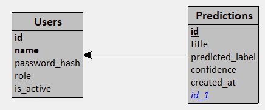

<h1> DESSAUX_Damien_ECF4 </h1>

ECF4 de la formation Développeur Concepteur en Science des Donnée de M2i.

# 1. Table des matières

- [1. Table des matières](#1-table-des-matières)
- [2. Description du projet](#2-description-du-projet)
- [3. Données](#3-données)
  - [3.1. Téléchargement des données](#31-téléchargement-des-données)
  - [3.2. Structure des données](#32-structure-des-données)
- [Structure du projet](#structure-du-projet)
- [4. Prérequis](#4-prérequis)
- [5. Installation](#5-installation)
  - [5.1. Cloner le projet depuis GitHub.](#51-cloner-le-projet-depuis-github)
  - [5.2. Créer un environement virtuel et installer les dépendances.](#52-créer-un-environement-virtuel-et-installer-les-dépendances)
  - [5.3. Variables d'environnement](#53-variables-denvironnement)
- [Utilisation](#utilisation)
  - [Script Jupyter](#script-jupyter)
  - [API](#api)
    - [Lancer l'API](#lancer-lapi)
    - [DataBase](#database)


# 2. Description du projet

L'objectif du projet est de concevoir et implémenter une pipeline NLP de bout en bout capable de classer un titre d'article comme **fiable** ou **trompeur**.

# 3. Données

## 3.1. Téléchargement des données

1. Créez un dossier `data` à la racine du projet.
2. Téléchargez l'archive https://www.kaggle.com/api/v1/datasets/download/jillanisofttech/fake-or-real-news.
3. Extrayez le contenue de l'archive dans le dossier `data`.

## 3.2. Structure des données

| Colonne | Type | Description |
| :- | :- | :- |
| `title` | str | Titre de l'article |
| `text` | str | Corps de l'article (non utilisé dans ce sujet) |
| `label` | str | `REAL` ou `FAKE` |

**Remarque** : Le sujet impose que la champ `title` soit renommée en `text`. Dans le notebook `ecf_fake_news.ipynb` le champ `text` fait donc référence au champ `title` du jeu de données.

# Structure du projet

```text
DESSAUX_DAMIEN_ECF4/
├── .gitignore
├── pyproject.toml
├── README.md
├── requirements.txt
├── run_api.py

├── api/
│   ├── main.py
│   ├── __init__.py
│   │
│   ├── core/
│   │   ├── database.py
│   │   ├── security.py
│   │   ├── settings.py
│   │   ├── log_config.yaml
│   │   └── __init__.py
│   │
│   ├── dependencies/
│   │   ├── auth.py
│   │   ├── ml_model.py
│   │   └── __init__.py
│   │
│   ├── models/
│   │   ├── user.py
│   │   ├── prediction.py
│   │   └── __init__.py
│   │
│   ├── schemas/
│   │   ├── user.py
│   │   ├── prediction.py
│   │   ├── utils.py
│   │   └── __init__.py
│   │
│   ├── routers/
│   │   ├── auth.py
│   │   ├── health.py
│   │   ├── user.py
│   │   ├── prediction.py
│   │   └── __init__.py
│   │
│   ├── services/
│   │   ├── user.py
│   │   ├── prediction.py
│   │
│   ├── utils/
│   │   ├── logger.py
│   │   ├── ml_model.py
│   │   └── __init__.py
│   │
│   └── logs/

├── data/
│   ├── fake_or_real_news.csv
│   └── titles_clean.csv

├── models/
│   ├── model_dense.keras
│   ├── model_bidirectional_lstm.keras
│   └── tf_idf_vectorizer.pkl

├── notebook/
│   └── ecf_fake_news.ipynb

├── docs/
│   └── ECF_NLP_TF_FakeNews.md

├── figures/
│   ├── 01_label_distrubution.png
│   ├── 02_length_text_distribution_label_fake.png
│   ├── 03_length_text_distribution_label_real.png
│   ├── 04_tokens_distribution_per_labels.png
│   ├── 05_history_model_dense.png
│   ├── 06_history_model_bidirectional_lstm.png
│   ├── 07_confusion_matrix_model_dense.png
│   ├── 08_roc_curve_model_dense.png
│   └── 09_confusion_matrix_model_dense_optimal_threshold.png
```

# 4. Prérequis

- Python 3.13+
- Git
- UV

# 5. Installation

## 5.1. Cloner le projet depuis GitHub.

Clonner le projet depuis GitHub en éxécuant la commande :

```bash
git clone https://github.com/DamienDESSAUX-M2i/DESSAUX_Damien_ECF4.git
```

## 5.2. Créer un environement virtuel et installer les dépendances.

Créez un environnement virtuel et installez les dépendances en éxécutant la commande :

```bash
uv sync
```

Puis téléchargez le modèle linguistique `en_core_web_sm` de `spaCy` en éxécutant la commande :

```bash
uv run -m spacy download en_core_web_sm 
```

## 5.3. Variables d'environnement

Créez un fichier `.env` à la racine du projet contenant les varialbes d'environnement suivantes :

```yaml
API_NAME = "fake_news_predictor"
DEBUG = True
API_PREFIX = "/api"

DATABASE_PATH = "data/api.db"

VECTORIZER_PATH = "models/tf_idf_vectorizer"
MODEL_PATH = "models/model_dense.keras"

SECRET_KEY = "my-super-secret-key"
ALGORITHM = "HS256"
ITERATIONS = 100000
ACCESS_TOKEN_EXPIRE_MINUTES = 30

LOG_LEVEL = "INFO"
LOG_PATH = "api/log/api.log"
```

# Utilisation

## Script Jupyter

Le fichier `ecf_fake_news.ipynb` peut être exécuté dans l'environnement JupyterLab. Pour lancer l'interface JupyterLab éxécutez la commande `jupyter lab`.

Le fichier `ecf_fake_news.ipynb` contient :
* une analyse exploratoire des données (exports des visualisations `figures/`).
* le prétraitement NLP :
  * nettoyage des données (fonction `clean_title`).
  * vectorialisation via la classe TfidfVectorizer de Sci-kit Learn (export `models/tf_idf_vectorize.pkl`).
* l'implémentation de deux modèles de classification :
  * Modèle Dense + TF-IDF (export `models/model_dense.keras`)
  * Modèle LSTM bidirectionnel + Embeddings (export `models/model_bidirectional_lstm.keras`)
* la comparaison des deux modèles.
* l'évaluation approfondie du modèle Dense + Tf-IDF.

## API

### Lancer l'API

Pour lancer l'API, éxécutez la commande `uv run run_api.py`.

L'API étant implémentée avec la bibliothèque `FastAPI`, elle dispose d'une documentation automatique disponible à l'adresse http://127.0.0.1:8000/docs.

**Description sommaire de l'API :**
* Les endpoints `/auth/register`, `/auth/login` et `/health` sont public, pour les autres endpoints il faudra générer un token de type **Bearer**. Lors de la création d'un utilisateur, son role est automatiquement **USER**.
* La liste de tous les utilisateurs et la suppression d'utilisateurs sont réservés au role **ADMIN**. Pour les besoins de l'exercice, un utilisateur **ADMIN** ayant pour username `admin` et pour mot de passe `admin` a été créé.
* Pour réaliser une prédiction, utiliser les endpoints `/predictions` ou `/predictions/batch`. Le endpoint `/predictions/me` retourne toutes les prédcitions de l'utilisateur courant. Le endpoint `/predictions/{prediction_id}` retourne la prédiction ayant pour id `prediction_id` si l'utilisateur est à l'origine de cette prédiction ou si l'utilisateur a pour role **ADMIN**.

**Remarque :** Par manque de temps, le logging de l'API n'est pas complet, seul la couche controller dispose d'un logging.

### DataBase

L'API utilise une database `SQLite` située dans le dossier `data/`. Cette database contient deux tables `Users` et `Predictions` respectant le MLD suivant :

 